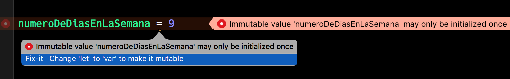

# Constantes

Una constante en Swift se declara usando la palabra reservada `let`.

```swift
let numeroDeDiasEnLaSemana = 7
```

Al igual que las variables, no es necesario declarar explícitamente el tipo de dato de la constante si se le asignará un valor inicial en la misma declaración. Podemos declarar una constante sin valor inicial, de la siguiente forma:

```swift
let numeroDeDiasEnLaSemana: Int // #=> Declaramos la constante tipo Int sin asignar un valor inicial
numeroDeDiasEnLaSemana = 7 // #=> Asignamos el valor a la constante
```

La característica de las constantes en Swift, es que una vez que se les asigna un primer valor, éste ya no puede ser cambiado, solamente leído.

```swift
print(numeroDeDiasEnLaSemana)   // => 7
numeroDeDiasEnLaSemana = 9      // Error! numeroDeDiasEnLaSemana ya tenía un valor
```

El compilador será inteligente y te sugerirá que cambies la declaración de tu constante para que ahora sea una variable y puedas asignar ese valor.

